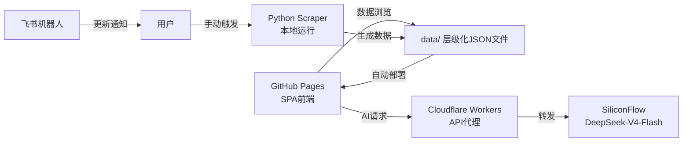

# 🏛️ Heritage Analysis — 文化遗产数字化历史分析系统

基于 **ccgp_fast_scraper v5** 日增量流水线，独立分支 `codex/heritage-analysis`。  
提供省份级博物馆数字化中标数据浏览、AI智能问答与Gap分析。

## 系统架构



## 项目结构

```
├── index.html              # SPA主页面
├── css/style.css           # 样式
├── js/
│   ├── app.js              # 主控制器(三级视图切换)
│   ├── charts.js           # ECharts图表仪表盘
│   ├── chat.js             # AI悬浮球
│   └── utils.js            # 工具函数
├── data/                   # 层级化数据文件
│   ├── version.json        # 版本号(前端检测更新)
│   ├── museums.json        # 博物馆名录
│   ├── summary/all_provinces.json
│   ├── {省}/summary.json
│   ├── {省}/charts.json
│   ├── {省}/gap.json
│   └── {省}/{博物馆}/projects.json
├── scraper/                # Python爬虫模块
│   ├── config.py           # 配置中心
│   ├── scrape_province.py  # 单省历史爬虫
│   ├── classify_projects.py # AI分类器
│   ├── name_matcher.py     # 博物馆名称模糊匹配
│   └── build_data_files.py # 数据整理器
├── cloudflare/
│   └── worker.js           # Workers AI代理
├── .github/workflows/
│   └── update-data.yml     # 数据更新工作流
└── README.md
```

## 快速开始

### 1. 获取博物馆名录

```bash
# museums.json 包含3个试点省份(陕西/四川/江苏)的博物馆列表
# 如需全国数据: 从国家文物局公开数据获取后替换 data/museums.json
```

### 2. 爬取省份数据

```bash
# 爬取单省3年历史数据
python scraper/scrape_province.py --province 陕西 --years 2023-2025

# 断点续传
python scraper/scrape_province.py --province 陕西 --years 2023-2025 --resume

# 多省爬取
python scraper/scrape_province.py --province 四川 --years 2023-2025
python scraper/scrape_province.py --province 江苏 --years 2023-2025
```

### 3. AI分类（可选，需要SILICONFLOW_API_KEY）

```bash
# 仅规则分类（免费）
python scraper/classify_projects.py --input output/raw/陕西/陕西_all.csv --output output/raw/陕西/陕西_classified.csv --rules-only

# 高价值项目AI分类
set SILICONFLOW_API_KEY=sk-your-key
python scraper/classify_projects.py --input output/raw/陕西/陕西_all.csv --output output/raw/陕西/陕西_classified.csv --high-value-only
```

### 4. 构建前端数据文件

```bash
python scraper/build_data_files.py --input output/raw/ --provinces 陕西,四川,江苏
```

### 5. 推送数据到GitHub

```bash
git add data/ output/
git commit -m "数据更新: 陕西/四川/江苏 2023-2025"
git push origin codex/heritage-analysis
```

GitHub Pages将在1-2分钟内自动部署。访问 `https://{username}.github.io/heritage-analysis/` 即可浏览。

## Cloudflare Workers 部署

```bash
cd cloudflare/
npx wrangler login
npx wrangler deploy

# 设置API Key环境变量
npx wrangler secret put SILICONFLOW_API_KEY
```

部署后更新 `js/chat.js` 中的 `CLOUDFLARE_WORKER_URL` 为你的workers.dev地址。

## 功能

| 功能 | 说明 |
|------|------|
| 📊 省份仪表盘 | 卡片概览 + 饼图/雷达图/柱状图/Top10 |
| 🏛️ 博物馆明细 | 项目表格 + 详情卡片 + 数字化类型标签 |
| 💬 AI悬浮球 | 可拖拽、上下文绑定、对话2天自动清理 |
| 🎯 Gap分析 | 识别未进行数字化采购的博物馆 |
| 📱 飞书通知 | 数据更新完成后推送汇总卡片 |

## 数据源

- P0: 中国政府采购网 (CCGP) 总站
- P1: 全国公共资源交易平台 (GGZY)
- P2: 各省CCGP分站
- P3: 各省公共资源交易中心

## 环境变量

| 变量 | 用途 |
|------|------|
| `SILICONFLOW_API_KEY` | SiliconFlow API Key (AI分类+Agent) |
| `FEISHU_APP_ID` | 飞书应用ID (通知推送) |
| `FEISHU_APP_SECRET` | 飞书应用密钥 |
| `FEISHU_CHAT_ID` | 飞书群聊ID |

## License

Internal Use
